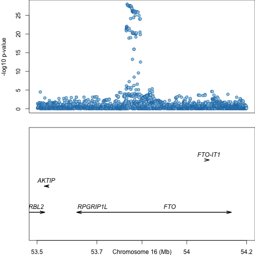
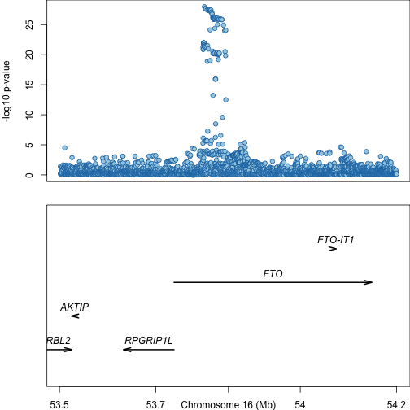

```r
library(RColorBrewer)
library(refflat)
palette <- brewer.pal(3, "Paired") 
par(mar = c(2,4,0,0), mfcol = c(2, 1))
plot(
  t2d_fto[["POS"]],
  -1 * log10(t2d_fto[["PVALUE"]]),
  pch = 21,
  col = palette[2],
  bg = palette[1],
  xlab = "",
  xaxt = "n",
  ylab = "-log10 p-value"
)
plot_refflat("chr16", t2d_fto[1, "POS"], t2d_fto[nrow(t2d_fto), "POS"])
```




```r
library(RColorBrewer)
library(refflat)
palette <- brewer.pal(3, "Paired") 
par(mar = c(2,4,0,0), mfcol = c(2, 1))
plot(
  t2d_fto[["POS"]],
  -1 * log10(t2d_fto[["PVALUE"]]),
  pch = 21,
  col = palette[2],
  bg = palette[1],
  xlab = "",
  xaxt = "n",
  ylab = "-log10 p-value"
)
plot_refflat(
  "chr16",
  t2d_fto[1, "POS"],
  t2d_fto[nrow(t2d_fto), "POS"],
  buffer = 1e3
)
```



